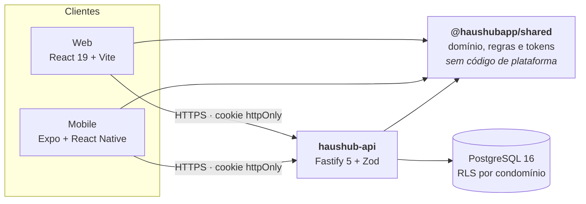

# HausHub

**Gestão de condomínios, para quem administra e para quem mora.**

Um condomínio brasileiro é administrado hoje por três ferramentas que não conversam entre si: uma
planilha, um grupo de WhatsApp e uma pasta de PDFs. O síndico sabe o que entrou e o que saiu porque
ele mesmo digitou; o morador descobre o valor do boleto perguntando. Quando o síndico troca, o
histórico vai junto.

O HausHub é o lugar único onde essas três coisas passam a viver — com a diferença de que o morador
enxerga a parte dele sem precisar pedir.

> **Status:** em desenvolvimento ativo. O frontend (web e mobile) e a API estão construídos e
> testados; a implantação em produção depende de contratações de infraestrutura, listadas em
> [O que falta](#o-que-falta).

---

## Para quem

### Síndico

Eleito ou contratado, responde pelo dinheiro, pelo cadastro e pela comunicação do prédio.

| Precisa                            | Hoje faz assim                     | No HausHub                                  |
| ---------------------------------- | ---------------------------------- | ------------------------------------------- |
| Emitir a taxa do mês               | Uma planilha e um boleto por vez   | Um clique, o prédio inteiro, com prévia     |
| Saber quem está em atraso          | Confere na mão, ou não confere     | O mapa de unidades mostra por cor           |
| Prestar contas                     | Manda PDF no grupo                 | Balancete publicado, com quem já visualizou |
| Consultar uma decisão de dois anos | Procura no WhatsApp                | Está no histórico, com data e autor         |

### Morador

Proprietário ou inquilino. Enxerga **os próprios dados** — e só eles.

| Precisa                   | Hoje faz assim             | No HausHub                                |
| ------------------------- | -------------------------- | ----------------------------------------- |
| Pagar a taxa              | Espera o boleto chegar     | Linha digitável na tela, a qualquer hora  |
| Saber se está em dia      | Pergunta ao síndico        | Histórico completo do próprio apartamento |
| Ficar sabendo de um aviso | Se viu o grupo naquele dia | Mural, com o que ainda não leu marcado    |
| Votar em uma decisão      | Comparece à assembleia     | Enquete, com apuração ao fechar           |

---

## O que faz

### Financeiro

- **Emissão em lote** — a taxa do mês para o prédio inteiro em uma requisição, com prévia do que
  será emitido e do que será ignorado (unidade vaga, cobrança já feita). Testado com 500 unidades.
- **Boleto com código de barras real** — 44 dígitos, dígito verificador módulo 11, linha digitável
  formatada.
- **Baixa, cancelamento e inadimplência** — uma cobrança nunca é apagada: é liquidada ou cancelada,
  e a trilha permanece. A varredura diária move o que venceu para "em atraso".
- **Despesas por categoria** e o resultado do mês contra o que foi efetivamente arrecadado.
- **Meta de arrecadação**, taxa de inadimplência e a comparação com o mês anterior.

### Comunicação

- **Mural de avisos** por categoria, com validade opcional.
- **Alcance real** — quantos moradores viram e quantos confirmaram leitura, sobre o total de
  moradores. Não uma estimativa.
- **Enquetes** com apuração por maior resto, e uma regra: **quem ainda não votou não vê o resultado
  parcial enquanto a votação está aberta.** Placar em tempo real transforma votação em efeito manada.

### Documentos

- Atas, balancetes, regulamentos e recibos, com categoria e busca.
- **Todo arquivo passa por antivírus antes de ficar disponível.** Enquanto não passou, o download é
  recusado.

### Cadastro

- **Mapa de unidades** por bloco e andar, colorido por situação — em dia, pendente, em atraso, vaga.
- Blocos e andares configuráveis: andares são uma lista de rótulos, não uma contagem, porque prédio
  tem térreo, mezanino e incorporadora que pula o décimo terceiro.
- Vínculo morador ↔ unidade, com validação de CPF pelos dígitos verificadores da Receita.

---

## Como é feito

TypeScript de ponta a ponta. **O domínio é um pacote só** — as regras de negócio, os formatos de
moeda e data, o cálculo de inadimplência e a apuração de votos são escritos uma vez e consumidos
pela web, pelo mobile e pelo servidor. Uma porcentagem não pode divergir entre a tela e o extrato
porque não existem duas implementações dela.

### Decisões que valem explicar

**O contrato veio antes do servidor.** O frontend foi escrito inteiro contra portas, rodando com
dados de exemplo, e um documento de 1.500 linhas fixou as 57 rotas, os formatos e as invariantes
antes da primeira linha de backend. A troca de dados de exemplo por HTTP foi feita em duas viradas,
cada uma com o servidor e o cliente entrando juntos.

**Isolamento entre condomínios é do banco, não da aplicação.** Cada tabela tem _row-level security_
por condomínio, e a aplicação conecta com um papel que não é superusuário — porque políticas não se
aplicam ao dono da tabela. Um `WHERE` esquecido em uma consulta não vira vazamento de dados entre
prédios: vira uma consulta que não retorna nada.

**As invariantes são restrições, não checagens.** Uma unidade nunca é cobrada duas vezes no mesmo
mês porque existe um índice único parcial dizendo isso — não porque um serviço conferiu antes. A
diferença aparece quando duas abas fazem a mesma coisa ao mesmo tempo.

**Dinheiro é centavo inteiro.** Nenhum valor monetário passa por ponto flutuante em lugar nenhum do
sistema.

**Data de calendário é data, não instante.** Uma cobrança emitida às 22h do dia 31 pertence àquele
mês. O processo roda em horário de São Paulo por causa disso, e não por conveniência.

### Privacidade e LGPD

- **CPF criptografado em repouso** (AES-256-GCM), com a chave fora do banco que guarda o texto
  cifrado. Só os quatro últimos dígitos ficam em claro, para a confirmação de identidade.
- **Trilha de auditoria que a aplicação não consegue reescrever** — `UPDATE` e `DELETE` são revogados
  do papel da aplicação. Um registro que pode ser editado não prova nada.
- **Exportação e exclusão de dados** (Art. 18) construídas antes do primeiro morador real ser
  cadastrado, não depois.
- **A exclusão apaga o cadastro e preserva o histórico financeiro**, porque uma cobrança é registro
  contábil e o Art. 16 II reconhece a obrigação legal de guarda.
- **Um voto nunca é associado ao apartamento** em lugar nenhum — nem no banco, nem no histórico de
  atividades.

### Sessão e acesso

Token opaco em cookie `httpOnly`, guardado com hash — um dump do banco não entrega sessões vivas.
Senhas com Argon2id. Permissão é sempre perguntada ao servidor: o que a tela mostra é conveniência,
o que o servidor recusa é a regra.

---

## Repositórios

| Repositório                                                | O que é                                                          |
| ---------------------------------------------------------- | ---------------------------------------------------------------- |
| [`haushub`](https://github.com/haushubapp/haushub)          | Monorepo do frontend — web, mobile e o pacote de domínio         |
| [`haushub-api`](https://github.com/haushubapp/haushub-api)  | A API — Fastify, PostgreSQL, 57 rotas                            |
| `@haushubapp/shared`                                        | O domínio, publicado deste monorepo e instalado pela API         |

Os dois repositórios são privados por enquanto, e o pacote é restrito à organização. O domínio é
publicado em vez de copiado pelo motivo que [Como é feito](#como-é-feito) dá: uma regra escrita uma
vez não pode divergir entre a tela, o aplicativo e o servidor.

---

## Qualidade

|                       |                                                          |
| --------------------- | -------------------------------------------------------- |
| **352** testes na API | banco PostgreSQL real via Testcontainers, não simulado    |
| **57** rotas          | todas contra o mesmo contrato que o cliente consome       |
| **14** migrações      | somente para frente, versionadas, verificadas no CI       |
| **500 × 24**          | 12 mil cobranças usadas para validar os planos de consulta |

Os testes de integração sobem PostgreSQL, MinIO e um servidor SMTP de verdade em contêiner. Uma
invariante deste sistema é uma restrição de banco, e nenhum simulador falha uma restrição — testar
contra um deles provaria só que o simulador concorda com o código.

---

## O que falta

Nada disso é desenvolvimento pendente. É infraestrutura a contratar e uma funcionalidade.

| Falta                                         | Destrava                            |
| --------------------------------------------- | ----------------------------------- |
| Bucket compatível com S3                      | Download de documentos              |
| Host de antivírus (ClamAV)                    | Download de documentos              |
| Provedor de e-mail e domínio de envio         | Recuperação de senha e convites     |
| Ambiente de homologação                       | Ensaios de rollback e restauração   |
| Fluxo de convite ao morador — cerca de um dia | Acesso do morador com conta própria |

Os três adaptadores externos já estão escritos e testados contra MinIO, Mailpit e ClamAV rodando em
contêiner. O que falta é apontá-los para uma conta — e, até que ela exista, o processo de produção
**se recusa a subir**. É a falha certa: melhor não subir do que entregar arquivo sem antivírus, ou
responder "enviamos o e-mail" sem ter enviado.

---

HausHub · Feito para o mercado brasileiro · Interface em português, código em inglês
